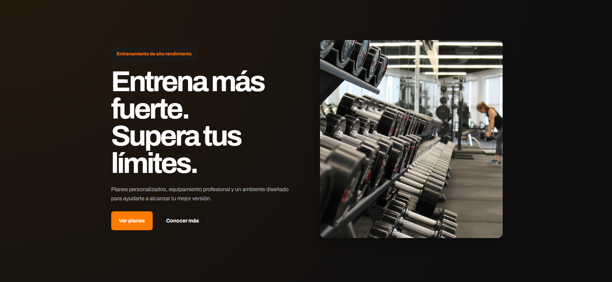
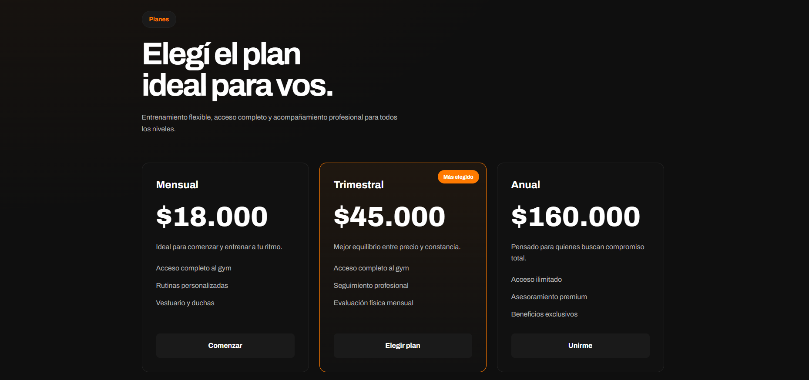
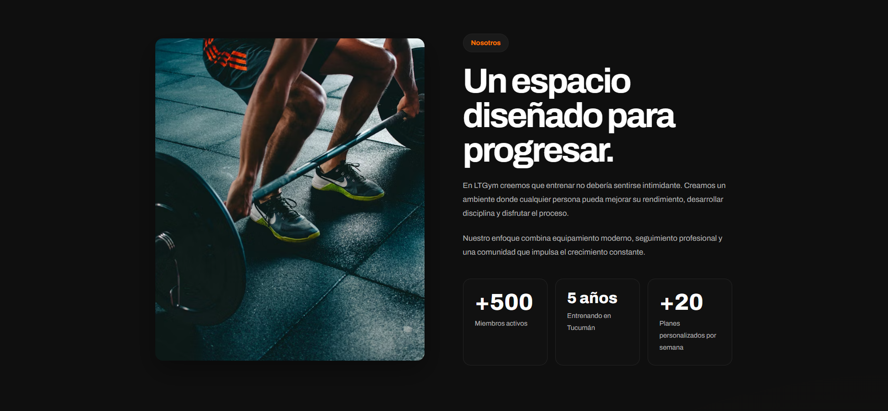

# LTGym Landing Page

Responsive gym landing page built with React and Vite.

This project was made as part of my frontend portfolio to practice responsive layouts, reusable components, and UI consistency using a mobile-first approach.

---

## Preview



---

## Features

* Mobile-first responsive design
* Reusable React components
* Responsive navbar with mobile menu
* Pricing, reviews, about us and contact sections
* Global CSS variables for easy customization
* Semantic HTML structure
* Clean dark UI with subtle visual depth

---

## Tech Stack

* React
* Vite
* CSS3

---

## Screenshots

### Hero Section


### Pricing Section



### About Section



---

## Installation

```bash
npm install
npm run dev
```

---

## Production Build

```bash
npm run build
```

---

## Live Demo

https://ltgym.vercel.app

---

## Notes

I tried to keep the design clean and responsive without relying on heavy UI libraries or overly animated layouts.

The goal of the project was to build something simple, realistic and customizable enough to be adapted for real local businesses.
